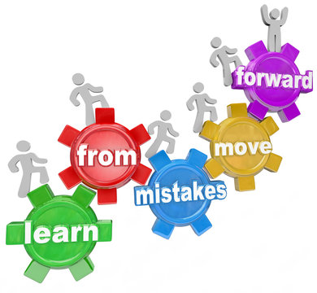

- [Collected my mistakes and experience in the software development path](#collected-my-mistakes-and-experience-in-the-software-development-path)
- [1. Database](#1-database)
    - [1.1. Postgres](#11-postgres)
        - [1.1.1. Vacuum in Postgres](#111-vacuum-in-postgres)
    - [1.2. Mongo](#12-mongo)
- [2. Langagues](#2-languages)
    - [2.1. Golang](#21-golang)
    - [2.2. Python](#22-python)

# Collected my mistakes and experience in the software development path

     

# 1. Database
## 1.1. Postgres
### 1.1.1. Vacuum in Postgres

# 2.Langagues
## 2.1. Golang
## 2.2. Python
